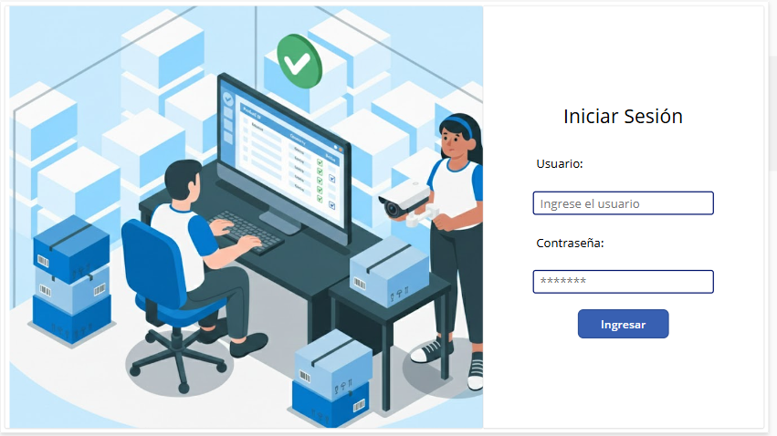
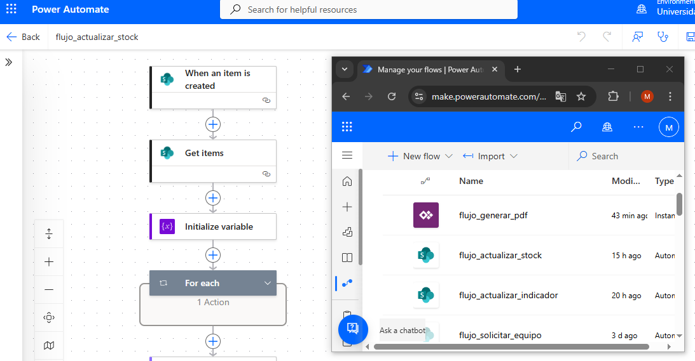
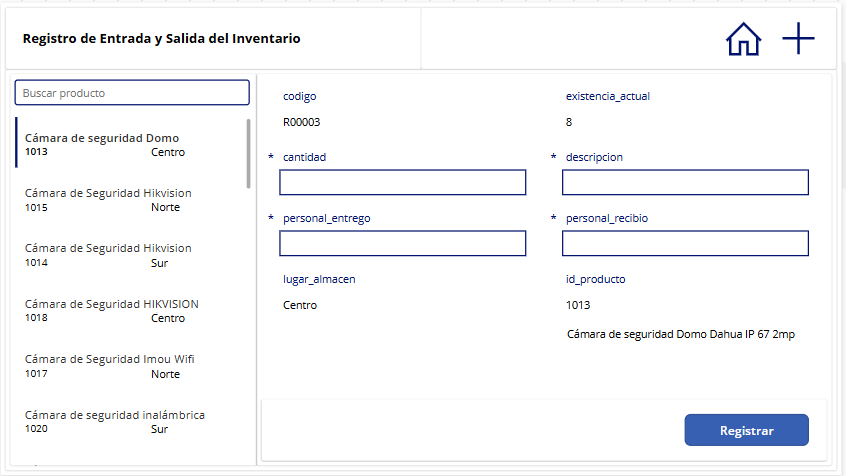
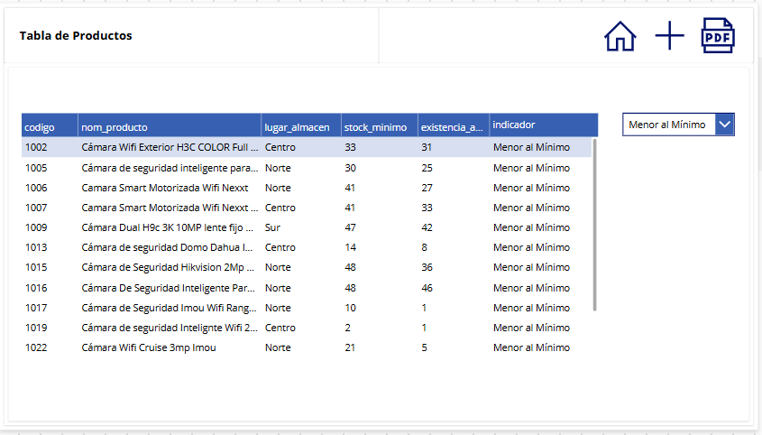

# 📦 App de Gestión de Inventario

## 🧭 Descripción General

Este proyecto consiste en el desarrollo de una aplicación de gestión de inventario construida con **Microsoft Power Apps** y automatizada con **Power Automate**, orientada a una empresa del rubro de seguridad electrónica (cámaras de seguridad y accesorios).

El sistema reemplazó un proceso de registro manual en papel, digitalizando el flujo completo de entrada y salida de mercancía, logrando reducir el tiempo de registro de **10 minutos a 5 minutos** por operación.

---

## ⚙️ Tecnologías Utilizadas

| Herramienta | Uso |
|---|---|
| **Microsoft Power Apps** | Desarrollo de la interfaz de usuario (Canvas App) |
| **Microsoft Power Automate** | Automatización de flujos de notificación y registro |
| **Microsoft SharePoint** | Fuente de datos y almacenamiento del inventario |

---

## Captura de pantalla

### Login en Power Apps

### Flujos en Power Automate

### Registro en Power Apps

### Generar PDF en Power Apps

## 📊 Resultados Obtenidos

| Métrica | Antes | Después | Mejora |
|---|---|---|---|
| Tiempo por registro | 10 min | 5 min | **↓ 50%** |
| Errores de inventario | Frecuentes | Mínimos | **↓ significativo** |
| Consulta de stock | Manual / sin acceso | Tiempo real | **✅ Inmediato** |
| Trazabilidad | Sin historial | Historial completo | **✅ 100%** |

---
## 🚀 Instalación

1. Importar cada paquete `.zip`.
2. Crear los datos en SharePoint.
3. Configurar las conexiones requeridas.
4. Ejecutar la aplicación.